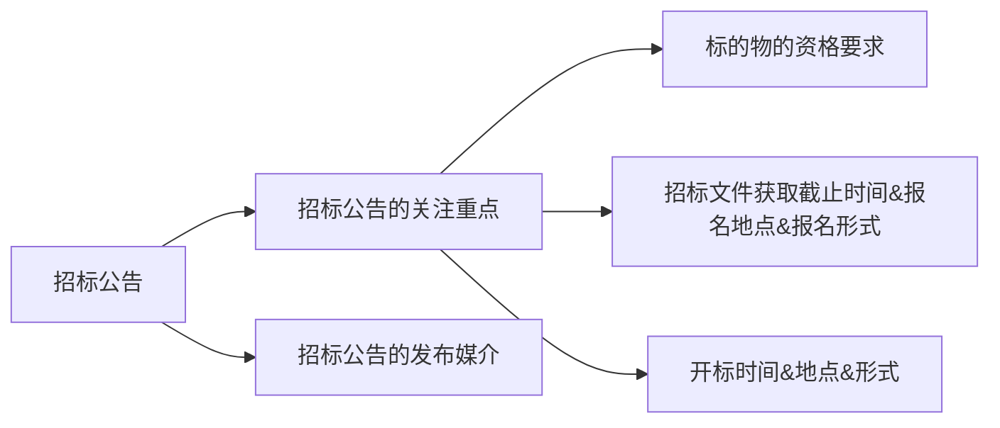

# 一次性弄懂如何写标书

## 初步认识招投标

### 招投标的重要性

招投标是一种规范化的商业交易流程，主要用于采购货物、工程或服务，以确保公平竞争和资源优化配置。招投标任为众多成交筛选方式的一种，在很多行业都是极其重要的一个环节。尤其如果和政府企事业单位进行合作的话，走招投标的流程是绕不开的。

### 招投标的应用范围

详细可以参考[中华人民共和国招标投标法][中华人民共和国招标投标法]第三条。简单来说，与公共利益相关、公共安全；与国有资金相关；与国际组织、国际援助相关的三大类项目，根据法律要求是一定要通过法律形式来采购的。另外一些民营上市公司的项目尽管不属于上面三大类，但出于通过公开和规范化的流程使采购流程更加的有序和有效同时防止自家员工以权谋私，也会采取招投标的形式（民营企业招投采购的流程完全由自己决定，并不受招标投标法约束）。

### 招投标流程

一个完整的招投标项目有几个关键节点，如下表格所示：

| 关键节点                             | 参与者               |
| ------------------------------------ | -------------------- |
| 立项、申请预算                       | 招标人               |
| 发布<a href="#招标公告">招标公告</a> | 招标代理机构         |
| 报名                                 | 招标代理机构、投标人 |
| 写标、封标                           | 投标人               |
| 开标                                 | 招标代理机构、招标人 |
| 评标                                 | 招标人、招标代理机构 |
| 中标                                 | 招标人               |

### 招标评审方式

### 招标文件的具体内容

## 写标

### 写标流程

### 重点内容

### 协同工作

### 标书检查

### 封标

## 补充材料

### 招标公告

## 参考资料

1. [一次性搞懂招投标，招投标过程详解][一次性搞懂招投标，招投标过程详解]
2. [中华人民共和国招标投标法][中华人民共和国招标投标法]

[一次性搞懂招投标，招投标过程详解]:https://www.bilibili.com/video/BV19Y4y147dP
[中华人民共和国招标投标法]: https://baike.baidu.com/item/%E4%B8%AD%E5%8D%8E%E4%BA%BA%E6%B0%91%E5%85%B1%E5%92%8C%E5%9B%BD%E6%8B%9B%E6%A0%87%E6%8A%95%E6%A0%87%E6%B3%95/5027177#2-2

