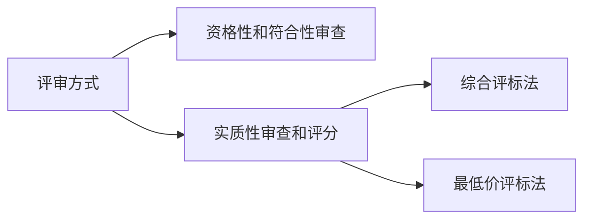
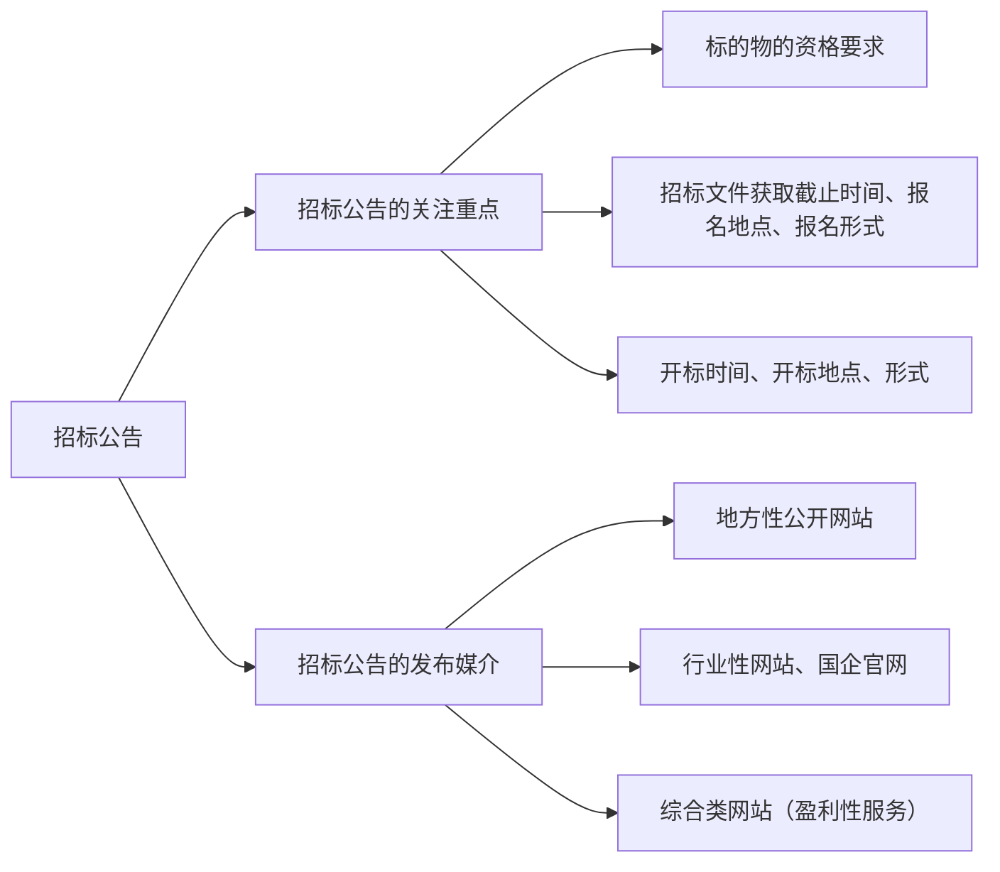
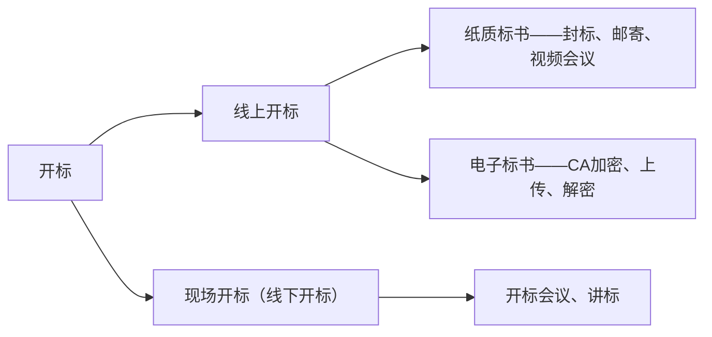

# 一次性搞懂招投标

## 初步认识招投标

### 招投标的重要性

招投标是一种规范化的商业交易流程，主要用于采购货物、工程或服务，以确保公平竞争和资源优化配置。招投标任为众多成交筛选方式的一种，在很多行业都是极其重要的一个环节。尤其如果和政府企事业单位进行合作的话，走招投标的流程是绕不开的。

### 招投标的应用范围

详细可以参考[中华人民共和国招标投标法][中华人民共和国招标投标法]第三条。简单来说，与公共利益相关、公共安全；与国有资金相关；与国际组织、国际援助相关的三大类项目，根据法律要求是一定要通过法律形式来采购的。另外一些民营上市公司的项目尽管不属于上面三大类，但出于通过公开和规范化的流程使采购流程更加的有序和有效同时防止自家员工以权谋私，也会采取招投标的形式（民营企业招投采购的流程完全由自己决定，并不受招标投标法约束）。

### 招投标流程

一个完整的招投标项目有几个关键节点，如下表格所示：

| 关键节点                                        | 参与者               |
| ----------------------------------------------- | -------------------- |
| 立项、申请预算                                  | 招标人               |
| 发布<a href="#biddingAnnouncement">招标公告</a> | 招标代理机构         |
| 报名                                            | 招标代理机构、投标人 |
| 写标、封标                                      | 投标人               |
| <a href="#bidOpening">开标</a>                  | 招标代理机构、招标人 |
| 评标                                            | 招标人、招标代理机构 |
| 中标                                            | 招标人               |

### <a id="reviewMethod">评审方式</a>

资格性和符合性审查主要是审核投标人的资格，判断是否符合项目要求以及投标文件是否具备最基本的完整性与合规性，这是进入下一步评审的前提（但与最终打了多少分没有关系，更准确地说是在确认有没有资格进入到下一步评审打分阶段）。

实质性审查和评分就是最终决定谁排名靠前了。目前主流的评标法分为综合评标法与最低价评标法，前者较为常见，按照招标文件的评分细则来打分，满分 100 分，价格分占一定的比例，还有较大的比例是根据资质、业绩方案、优惠政策等更多维度进行打分（各个评分点的权重，都会体现在招标文件的评分细则里）。后者一般是对价格以外的其他部分评审后，评审合格的选取当中最低价推荐为中标人。

### 招标文件的内容

一份完整的招标文件通常分为以下几个部分：
| 招标内容 | 重要程度 | 描述 |
| ----------------------- | -------- | ------------------------------------------------------------ |
| 招标公告 | 🌟 | 即招标网站上看到的内容，是项目的“轮廓”。 |
| 采购需求\技术或服务需求 | 🌟🌟🌟🌟 | 主要涉及到报价，如果是货物类、设备类采购，同时要采购许多种产品，需求清单一定会放在这部分。项目相关的其他商务要求、技术要求也会有所体现，例如付款方式、质保期、售后服务。这部分最好整个都看一下，因为它内容涉及到后续中标以后的事情，另外它还会涉及到在做标书的时候，各个方面的针对性的响应（最起码要知道别人要什么，才知道写的时候怎样写到点子上）。 |
| 投标须知 | 🌟🌟 | 最重要的是开头的**须知前附表**，需要重点看它的投标文件递交份数、样品、投标保证金、履约保证金等相关的内容。除了须知前附表，还要关注投标文件的组成部分、投标文件装订和密封的要求。 一般来说，投标须知是整个招标文件里内容最多的，但绝大部份都是不需要太多关注的程式化的内容。对于没有太多招投标经验的朋友，最好是在这个章节采用“看标题找重点”的方式来看，即阅读时将重心放在标题，寻找到关键点之后再去关注它的细节性内容。长此以往，就能锻炼出快速定位重点的能力。 |
| 评分标准 | 🌟🌟🌟🌟🌟 | 在<a href="#reviewMethod">评审方式</a>这部分讲过了，这个章节主要用来写标书时作为参考，明晰标书评分的关键点。 |
| 合同条款 | 🌟 | 重要程度一般，因为这里是甲方给出的合同模版。可以看下里面的商务条款，其他的作用基本没有（~~甲方出的合同也改不了~~）。 |
| 格式模版 | 🌟🌟🌟 | 做标书时经常先把格式模版整个复制粘贴，然后开始做。后期在把内容填充进去后，如果发现有不合适的地方，按照实际情况调整一下（比较常见的是表格还有封面模版）。 |

## 补充材料

### <a id="biddingAnnouncement">招标公告</a>

### <a id="bidOpening">开标</a>

## 参考资料

1. [一次性搞懂招投标，招投标过程详解][一次性搞懂招投标，招投标过程详解]
2. [中华人民共和国招标投标法][中华人民共和国招标投标法]

[一次性搞懂招投标，招投标过程详解]: https://www.bilibili.com/video/BV19Y4y147dP
[中华人民共和国招标投标法]: https://baike.baidu.com/item/%E4%B8%AD%E5%8D%8E%E4%BA%BA%E6%B0%91%E5%85%B1%E5%92%8C%E5%9B%BD%E6%8B%9B%E6%A0%87%E6%8A%95%E6%A0%87%E6%B3%95/5027177#2-2
