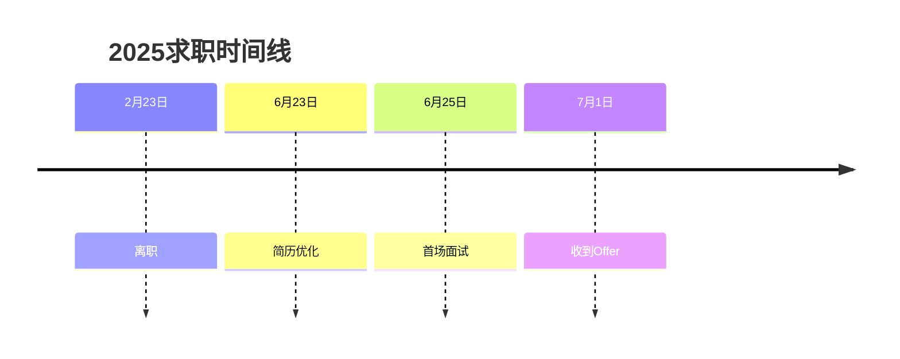

# 前端 2025 年 6 月找工作总结

## **求职概况**

在 2025 年 2 月 23 日正式离职，Gap 4 个月后，于 6 月 24 日重新开始投递简历。花了两天时间修改简历（6 月 23 日至 24 日），已于 7 月 7 日在新公司入职。

|     指标     | 数量 |              备注               |
| :----------: | :--: | :-----------------------------: |
|  沟通 HR 数  |  66  | BOSS 直聘，没有有其他软件上沟通 |
|  简历投递数  |  18  |      约五分之二是邀请投递       |
|  面试转化率  | 16%  |        3 面试 / 18 投递         |
| Offer 转化率 | 66%  |        2 Offer / 3 面试         |

## **具体行动**

### 投递策略

- 渠道：
  - 主要投递 BOSS 直聘。
  - 万码优才体验很差，各种邀请投递，但是不像真人。
- 针对性调整（BOSS 直聘）：
  - 优化<a href="#greetingWords">打招呼语</a>，注意分段。因为是给 HR 看，主要说清经验、学历、技术栈（简单地写）。
  - 开通了会员，提升了一定曝光率（事实上我开完的第二天，已经收到之前面过的公司 Offer 了。我个人感觉没啥用，提升曝光也只是让更多的外包来你，但是我的一位面霸朋友说有用。）;

### 面试经历

- 公司列表

  | 企业               | 轮次            | 面试内容                                                             | 结果                                                                             |
  | ------------------ | --------------- | -------------------------------------------------------------------- | -------------------------------------------------------------------------------- |
  | 某银行外包         | 技术面          | 八股文                                                               | 一面通过，主动拒绝了第二轮业主面，因为面试官说不喜欢放鸽子，基本可以算作 Offer。 |
  | 某 AI 行业创业公司 | 技术面 + CEO 面 | 浏览器运行原理 + 深入项目 + 现场实现一个 AI 对话框（允许用 AI 辅助） | 3 个小时，经历了技术 1 面 + CEO 面 + 现场实操 + 开放交流，已入职。               |
  | 某车企外包         | 技术面          | UniApp + 性能优化 + 工程化                                           | 一面挂，因为某个猎头主动推的，所以面之前不了解相关内容，也没准备 UniApp 相关的。 |

- 高频问题及回答思路（非技术相关）

  | 高频问题                         | 回答思路                                                                                                                    |
  | -------------------------------- | --------------------------------------------------------------------------------------------------------------------------- |
  | 为什么离开上家？                 | 说“希望有更好的职业发展”即可，真实情况 nobody care（不要说任何上家坏话）。                                                  |
  | 面了几家公司，手里有几个 offer？ | 用人方想知道你对公司的意向度有多高，从你的 offer 数判断你能力怎么样。如果刚开始面试，标准回答是“第二家，上家已经进入二面”。 |
  | 遇到最大的困难是什么？           | 回答“场景 + 困难 + 解决方式 + 个人扮演的角色”。                                                                             |
  | 现在住哪里？                     | 如实说即可，表达可以搬家的意愿                                                                                              |

- <a href="#technicalQuestion">技术问题（内容太长，见附录）</a>

## **成果与不足**

### 积极进展

- 学会了如何去写简历：先是写给 HR 看，才写给面试官看（报菜名 + 深挖项目难点，遵循 STAR 法则）。
- 了解自己在市场上的竞争力，年包得到了较大提升。

### 主要问题

- 面试短板：回答问题应该采用“总分”结构，一上来就深入到细节，会让人感到表达能力差。
- 其他障碍：不擅长谈判薪资，这点还要去学习。

## 面试方法论

### 如何准备面试

面试的五个部分：

- 自我介绍（5%，但是一定程度上会决定后面面试问什么）
- 八股文问答（10%-20%，只要不是最基础的都答不上，不会减分太多。）
- 框架和工具问答（20%，vue/react 的源码，vue/react 的一些 api 使用，webpack/vite 相关）
- 项目提问（30-40%，介绍自己的项目量级，难点，和项目中的工作内容与做的一些亮眼的事情）
- 场景题思路解决 （20%，列举一些场景，问你一个设计思路。）

### 如何做自我介绍

- 名字-年限
- 主要技术栈（直接决定了框架提问部分问你啥，不熟悉的就在这里提前示弱没关系的）
- 最近做的项目情况以及你在项目中的工作内容（一定要准备好，这里直接决定了后面会问你啥，甚至有可能引导面试官不问八股文直接问你的项目）

> 示例：我叫 XXX，现在做了 4 年前端，主要技术栈是 Vue，有少部分项目用到 UniApp 和 Electron ， React 有一定的了解（React 实在不熟，可以不说，但是 20K 以上一定要两个都会），做过一些练手项目。我上家公司是 XXX 公司，在公司做的核心业务是 XXX。该系统是 XXX，业主单位是 XXX。这个项目是 Vue3 技术栈。我在项目里是作为核心前端，项目的整体的请求设计，很多组合式函数抽离以及质量的把控都是我这边来负责的。

### 项目提问（最重点的）

- 设计好自己项目的亮点和难点
  - 一定要确保自己写的亮点难点自己知道具体怎么做
  - 设计好一个业务中的使用场景越具体越好
- 工作中你做的一些有价值的事情
- 封装的一些业务组件，遇到的痛点，怎样去封装。
- 做了一些项目工程化工具，让开发更高效，比如定义项目的 eslint，项目模板生成脚手架。核心在于你思考自己平常开发项目时有哪些痛点，哪些重复做的机械操作，构想一个工具来决绝这个痛点。
- 项目的量级和主要业务描述，什么行业，用户是谁，业主是谁（如果是），对行业的相关认知。
- 项目的量级和主要业务描述

详细可以看看 UP 主 三十的前端课总结的<a href="#preparationGuide">《前端面试准备指南》</a>

### 关于 AI 的提问

核心在于表明自己拥抱 AI，擅用 AI，并能够借助 AI 承当更多地工作量。

### 面试策略

我自己是准备从拿外包和小公司面试练手，后面再面一些中厂的，但是现在这家公司面试下来第一感觉比较好，就直接入职了。两家外包面下来全是八股文，这种情况如果两个人一起找工作，轮流去面很容易就拿到 Offer 。负责的面试官司会深入项目，涉及到一些场景题，这会比较看重平时的积累。

## **未来计划**

系统性地整理前端知识，整理出思维导图。

## 参考资料

- [《前端面试准备指南》- 三十的前端课 ](https://www.bilibili.com/opus/1056435102988369970)

## **附录**

### <a id="greetingWords">找招呼语</a>

> 您好！我是一名有 4 年开发经验的前端开发工程师，我的优势如下:
> · 计算机专业背景，全日制本科，学信网可查。
> · 熟练掌握 JavaScript、Java、SQL，拥有企业级开发经验。
> · 了解企业软件开发全流程，支持跨部门协作，推动内部协同效率。
> · 英语六级，口语写作能力强，日常会总结技术文档。

### <a id="technicalQuestion">技术问题</a>

> ## 某银行外包
>
> ### JS
>
> - 什么是闭包
>
> - Promise 使用场景
>
> - this 的指向
>
> - 作用域链
>
> ### Vue
>
> - Vue3 通讯方式
> - Vue2 和 Vue3 的区别
> - Vue3 Diff 算法相比 Vue2 提升了哪些
>
> ### Webpack
>
> - 做了哪些性能优化
> - 分包 Webpack 是如何实现的
>
> ### CSS
>
> - 什么是 BFC
>
> ## 某 AI 创业公司
>
> 内容实在太多，只挑重要部分记录。和外包只问八股不同，会深挖简历上的项目经历去问。
>
> ### 浏览器运行原理
>
> - 窗口输入 url 后发生什么
>
> ### Vue
>
> - Vue3 相比 Vue2 在哪里提升
> - UI 组件库之间的区别
>
> ### 工程化
>
> - 项目中怎么做工程化
> - 怎么做技术选型
> - 如何去设计组件
>
> ## 某车企外包
>
> ### UniApp
>
> - 生命周期（UniApp 的，一下子大脑宕机了，UniApp 这块没问下去）
>
> ### 性能优化
>
> - Lighthouse 的四项指标是什么
> - 怎样理解代码分割
>
> ### Vue
>
> - Ref 和 Reactive 的区别
>
> ### 工程化
>
> - 怎么理解工程化
>
> ### TypeScript
>
> - Type 和 Interface 的区别
>
> ### Webpack
>
> - 配置了哪些东西
